<!-- Typing animation banner -->

 

<!-- Social badges -->

---

## 📊 GitHub Metrics

### 📅 Isometric Commit Calendar

---

<table width="100%">
  <tr>
    <td width="50%" align="center">

### 🈷️ Languages Activity

  </td>
    <td width="50%" align="center">

### 💡 Coding Habits

  </td>
  </tr>
</table>

---

<table width="100%">
  <tr>
    <td width="50%" align="center">

### 🏆 Achievements

  </td>
    <td width="50%" align="center">

### 📰 Recent Activity

  </td>
  </tr>
</table>

---

<table width="100%">
  <tr>
    <td width="50%" align="center">

### ✨ Stargazers

  </td>
    <td width="50%" align="center">

### 👨‍💻 Lines of Code

  </td>
  </tr>
</table>

---

### 🎟️ Issues & Pull Requests Follow-up

